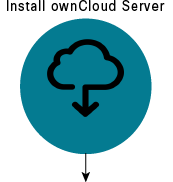
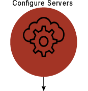
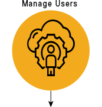

#ownCloud Server Quick Start Guide
ownCloud is a flexible open source file synchronization  and sharing solution. 

Install your own server to store and synchronize files. To learn more about ownCloud capabilities, see [ownCloud Administration Guide] (https://doc.ownCloud.org/server/latest/admin_manual/).

This quick start provides a list of common administrative workflow for an ownCloud server installation. What would you like to do?

 

# </img>Install ownCloud Servers 

Administrators can install and configure an  ownCloud sever that runs on Linux, client applications for Microsoft Windows, Mac OS X and Linux, and mobile clients for the Android and Apple iOS operating systems.

This example shows how to install ownCloud on a server on your Linux system. 

## Before you Install
1. Refer to the [System Requirements] (https://doc.ownCloud.org/server/latest/admin_manual/installation) section and ensure you meet the requirements.
2. Set up a sudo user and firewall on your server. 

**Note**: Administrators must have command line or cron access.

##Package Manager Installation on Linux
Use Pacakge Manager for single-server setups. To install production environemnts, see [Manual Installation](#manual).

1. Download and install a LAMP stack. You can use this to create your web application or web site. 
2. [Download](https://download.ownCloud.org/download/repositories/stable/ownCloud/) the install package for the Ubuntu operating system.  
3. Complete the installation instructions on the download page.
4. Go to http://localhost/ownCloud. 
5. Enter your username and password.
6. Click **Finish Setup**. 	

For detailed instructions, see the [In-Depth guide] ( https://doc.ownCloud.org/server/latest/admin_manual/installation/installation_wizard.html#in-depth-guide). 

##Manual Installation on Linux
Manually install from the tar archive for production environments. To manually install, see [Manual Installation] (https://doc.ownCloud.org/server/latest/admin_manual/installation/source_installation.html). To set up single servers, see [Package Manager Installation](#package).

##Related Information
- [Server Configuration](servers.md)
- [User Management] (user.md)
- [Server Access](access.md)
- [ownCloud Quick Start](introduction.md)

